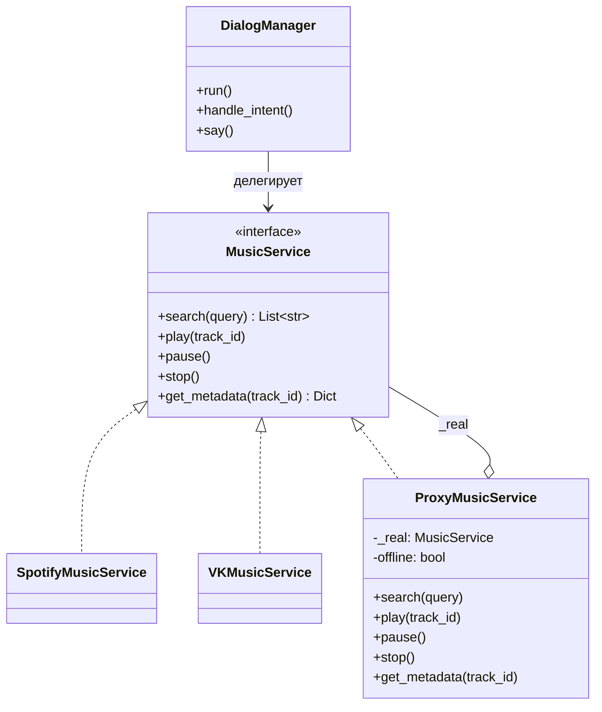
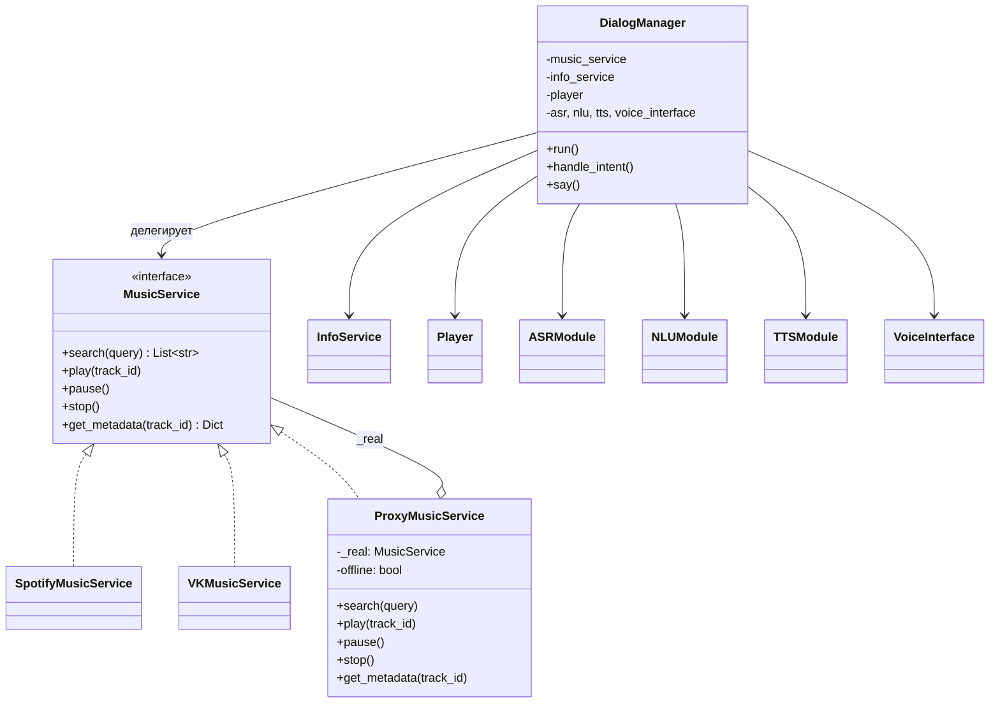

# Лабораторная работа 04 (2 часа)
## Тема: Делегирование и Proxy — реализация

---

## 1. Краткое описание назначения реализуемых паттернов

### Делегирование (Delegation)
**Делегирование** — приём, при котором один объект не выполняет задачу сам, а передаёт её другому объекту (делегату), реализующему тот же или совместимый интерфейс. В проектируемой системе делегирование используется для разделения ответственности между компонентами:

- **`DialogManager`** не реализует логику распознавания речи, понимания намерений и работы с музыкой/информацией. Он лишь координирует поток данных и вызывает методы соответствующих сервисов: `ASRModule`, `NLUModule`, `MusicService`, `InfoService`, `TTSModule`, `VoiceInterface`.
- **`ProxyMusicService`** (внутри цепочки работы с музыкой) делегирует большинство операций реальному музыкальному сервису `_real`: `search`, `pause`, `stop`, `get_metadata`.

### Proxy (Заместитель)
**Паттерн Proxy** предоставляет объект-заместитель, который контролирует доступ к реальному объекту и может добавлять собственную логику (проверку прав, кеширование, офлайн/онлайн-ограничения и т.п.), не меняя код реального сервиса.

В проекте реализован **`ProxyMusicService`**:

- реализует интерфейс `MusicService`;
- принимает «реальный» музыкальный сервис (`real: MusicService`);
- в методе `play()` выполняет проверку прав/условий воспроизведения (в терминах проекта — офлайн-доступности) и затем вызывает `real.play()`.

---

## 2. Описание предметной области

Прикладная область для выполнения лабораторной работы: разработка программного компонента, имитирующего умный голосовой помощник для управления мультимедиа-функциями.

Пользователь формулирует запрос (в консоли вводом текста или через имитацию аудио), после чего программа выполняет последовательность действий:

1. **Ввод**: получение аудио/текста.
2. **Распознавание речи (ASR)**: преобразование входных данных в строку.
3. **Понимание намерений (NLU)**: определение того, что хочет пользователь (музыка, новости, громкость, выключение и т.д.).
4. **Обработка намерения**: поиск/воспроизведение музыки, получение справки/новостей, установка громкости.
5. **Озвучивание**: синтез речи (TTS) и вывод в `VoiceInterface`.

Цели разработки соответствующих программ:

- продемонстрировать принцип **делегирования** (централизованная координация при вынесении логики в независимые модули);
- продемонстрировать паттерн **Proxy** (контроль условий воспроизведения через обёртку над реальным сервисом);
- обеспечить возможность заменять реализации сервисов (Spotify ↔ VK ↔ Yandex и т.п.) без изменения основной логики диалога, за счёт абстракций `interfaces`.

Примеры существующих программ (обобщенно): голосовые ассистенты, выполняющие запросы пользователя к музыке и информации, например домашние медиасистемы и ассистенты из экосистем крупных компаний.

---

## 3. Объекты и функциональные возможности проектируемой системы

В системе выделяются следующие основные объекты:

- **Пользователь**: задаёт запрос (“включи музыку”, “громкость 7”, “выключись”, “новости …” и т.п.).
- **`DialogManager`**: центральный координатор диалога. Он управляет циклом “ввод → ASR → NLU → обработчик намерения” и формирует ответ через `say()`.
- **`ASRModule`**: модуль распознавания речи (`SimpleASR` или `CloudASR`).
- **`NLUModule`**: модуль понимания текста (`RuleBasedNLU` на правилах или `MLNLUModule`-заглушка).
- **`MusicService`**: музыкальный сервис (`SpotifyMusicService`, `VKMusicService`, `YandexMusicService`, `LocalFileMusicService`) и его заместитель **`ProxyMusicService`**.
- **`InfoService`**: справочный сервис (`WikipediaInfoService`, `GoogleInfoService`, `YandexInfoService`), который возвращает текст и новости.
- **`Player`**: проигрыватель (`BasicPlayer`, `BluetoothPlayer`, `StreamingPlayer`).
- **`TTSModule`**: синтез речи (`BasicTTS`, `NeuralTTS`).
- **`VoiceInterface`**: интерфейс ввода/вывода (`ConsoleInterface`, `MicrophoneInterface`).

Функциональные возможности:

- `music`: поиск (возврат первого трека из списка) и запуск воспроизведения;
- `info`: запрос информации через `InfoService`;
- `news`: получение списка новостей и озвучивание каждого пункта;
- `volume`: установка громкости через `Player.set_volume(level)`;
- `exit`: завершение работы ассистента (`DialogManager.stop()`).

---

## 4. Объекты и классы проектируемой системы

Ниже перечислены интерфейсы и реализации, которые формируют систему.

| Класс / модуль | Назначение |
|----------------|------------|
| `interfaces` | Абстрактные интерфейсы: `MusicService`, `InfoService`, `Player`, `ASRModule`, `NLUModule`, `TTSModule`, `VoiceInterface`. |
| `DialogManager` | Центральный координатор диалога. Делегирует выполнение конкретным модулям (ASR/NLU/Music/Info/TTS/Voice). |
| `ProxyMusicService` | Заместитель для `MusicService`. Контролирует офлайн-доступность в `play()` и делегирует остальное `_real`. |
| `SpotifyMusicService`, `VKMusicService`, `YandexMusicService`, `LocalFileMusicService` | Конкретные музыкальные сервисы (заглушки): `search`, `play`, `pause`, `stop`, `get_metadata`. |
| `WikipediaInfoService`, `GoogleInfoService`, `YandexInfoService` | Справочные сервисы: `get_info()`, `get_news()`. |
| `BasicPlayer`, `StreamingPlayer`, `BluetoothPlayer` | Проигрыватели: громкость и имитация вывода. |
| `SimpleASR`, `CloudASR` | Распознавание речи: локальная имитация и облачная заглушка. |
| `RuleBasedNLU`, `MLNLUModule` | Понимание намерений: правила по ключевым словам или ML-заглушка. |
| `BasicTTS`, `NeuralTTS` | Синтез речи (заглушки). |
| `ConsoleInterface`, `MicrophoneInterface` | Ввод/вывод: ввод текста с консоли или имитация микрофона. |
| `main.py` | Точка входа: сборка зависимостей (Dependency Injection) и запуск выбранной конфигурации. |

Диаграмма классов (кратко, для пояснения связей):



---

## 5. Пример реализации подсистемы на основе принципа делегирования

По заданию реализуется подсистема, в которой основная логика сосредоточена в одном “координаторе” (`DialogManager`), а специализированные операции вынесены в отдельные сервисы. Такой подход отвечает идее делегирования.

### Делегирование в `DialogManager`

Диалоговый цикл реализован в методе `run()`:

- `DialogManager` получает данные через `voice_interface.listen()`;
- полученное “аудио” передаётся в `asr.recognize(audio)`;
- распознанный текст направляется в `nlu.parse(text)`, где определяется `intent`;
- выбранный обработчик вызывает нужные сервисы:
  - `music` → `music_service.search()` и `music_service.play()`;
  - `info` → `info_service.get_info()`;
  - `news` → `info_service.get_news()`;
  - `volume` → `player.set_volume(level)`;
  - `exit` → `DialogManager.stop()`.

Озвучивание ответа также является делегированием:

- текст ответа передаётся в `tts.synthesize(text)` для получения аудиобайтов;
- затем результат отправляется в `voice_interface.speak(audio)`.

### Делегирование в подсистеме музыки

Внутри `ProxyMusicService` большинство методов просто передают управление реальному сервису `_real`. Это демонстрирует делегирование “внутри цепочки сервисов” и позволяет менять музыкальный провайдер без изменения логики прокси.

---

## 6. Пример реализации подсистемы на основе паттерна Proxy

В проекте Proxy применяется для контроля возможности воспроизведения в офлайн-режиме.

`ProxyMusicService`:

- имеет поле `_real` типа `MusicService` и параметр конструктора `offline: bool`;
- реализует все методы интерфейса `MusicService`, сохраняя совместимый контракт с реальными сервисами;
- в методе `play()` выполняет дополнительную проверку:
  - печатает сообщение `Proxy: проверка прав`;
  - если `offline=True` и реальный сервис не офлайн (`_real.is_offline is False`), печатает `Этот сервис не может быть воспроизведен оффлайн`;
  - затем всё равно вызывает `_real.play(track_id)`.

Назначение Proxy здесь — централизованно добавить политику доступа к воспроизведению (офлайн/онлайн) без изменения кода конкретных сервисов (`SpotifyMusicService`, `VKMusicService` и т.д.).

---

## 7. Конфигурирование системы

Конфигурирование выполняется в `main.py` за счёт передачи зависимостей в конструктор `DialogManager` (Dependency Injection). Задаются три сценария:

### Локальная офлайн-конфигурация (`dialog_offline`)
- `music_service`: `ProxyMusicService(SpotifyMusicService(), offline=True)`
- `info_service`: `WikipediaInfoService`
- `player`: `BasicPlayer`
- `asr`: `SimpleASR`
- `nlu`: `RuleBasedNLU`
- `tts`: `BasicTTS`
- `voice_interface`: `ConsoleInterface`

### Облачная/онлайн мультимедийная конфигурация (`dialog_smart`)
- `music_service`: `ProxyMusicService(SpotifyMusicService())` (офлайн-ограничение отключено)
- `info_service`: `GoogleInfoService`
- `player`: `BluetoothPlayer`
- `asr`: `CloudASR`
- `nlu`: `MLNLUModule`
- `tts`: `NeuralTTS`
- `voice_interface`: `MicrophoneInterface`

### Гибридная конфигурация (`dialog_car`)
- `music_service`: `VKMusicService` (без прокси)
- `info_service`: `YandexInfoService`
- `player`: `StreamingPlayer`
- `asr`: `SimpleASR`
- `nlu`: `RuleBasedNLU`
- `tts`: `NeuralTTS`
- `voice_interface`: `MicrophoneInterface`

Переключение конфигурации выполняется выбором строки `dialog_offline.run()` / `dialog_smart.run()` / `dialog_car.run()` в блоке `if __name__ == "__main__"` (раскомментированием нужной строки).

---

## 8. Примеры работы программы (логи)

Запуск: `python3 main.py` с конфигурацией `dialog_offline`. Ввод с консоли:
`включи музыку`, `громкость 7`, `выключись`.

Вывод:
```
[ASSISTANT]: Голосовой ассистент запущен
Введите текст: [USER]: включи музыку
Proxy: проверка прав
Этот сервис не может быть воспроизведен оффлайн
Spotify: play spotify_track_1
[ASSISTANT]: Воспроизвожу музыку
Введите текст: [USER]: громкость 7
vol 7
[ASSISTANT]: Громкость установлена: 7
Введите текст: [USER]: выключись
[ASSISTANT]: Завершение работы
```

По логам видно:

- координация диалога выполняется `DialogManager`;
- намерение `music` распознаётся `RuleBasedNLU` и приводит к вызовам `music_service.search()` и `music_service.play()`;
- контроль доступа реализован через `ProxyMusicService.play()` (сообщение об офлайн-ограничении выводится до вызова реального `SpotifyMusicService.play()`);
- установка громкости делегируется `player.set_volume(7)` (в логе: `vol 7`);
- команда `выключись` распознаётся как `exit` и останавливает цикл через `DialogManager.stop()`.

---

## 9. Список источников

- “Design Patterns: Elements of Reusable Object-Oriented Software” (GoF): Delegation/Proxy как базовые паттерны проектирования.
- Документация по Python и интерфейсам (модули `abc`, абстрактные классы, Dependency Injection как принцип проектирования).

# Лабораторная работа 04 (2 часа)
## Тема: Делегирование и Proxy — реализация

---

## 1. Краткое описание назначения реализуемых паттернов

### Делегирование (Delegation)
**Делегирование** — приём, при котором один объект не выполняет задачу сам, а передаёт её другому объекту (делегату), реализующему тот же или совместимый интерфейс. В проектируемой системе делегирование используется для разделения ответственности между компонентами:

- **`DialogManager`** не реализует логику распознавания речи, понимания намерений и работы с музыкой/информацией. Он лишь координирует поток данных и вызывает методы соответствующих сервисов: `ASRModule`, `NLUModule`, `MusicService`, `InfoService`, `TTSModule`, `VoiceInterface`.
- **`ProxyMusicService`** (внутри цепочки работы с музыкой) делегирует большинство операций реальному музыкальному сервису `_real`: `search`, `pause`, `stop`, `get_metadata`.

### Proxy (Заместитель)
**Паттерн Proxy** предоставляет объект-заместитель, который контролирует доступ к реальному объекту и может добавлять собственную логику (проверку прав, кеширование, офлайн/онлайн-ограничения и т.п.), не меняя код реального сервиса.

В проекте реализован **`ProxyMusicService`**:

- реализует интерфейс `MusicService`;
- принимает «реальный» музыкальный сервис (`real: MusicService`);
- в методе `play()` выполняет проверку прав/условий воспроизведения (в терминах проекта — офлайн-доступности) и затем вызывает `real.play()`.

---

## 2. Описание предметной области

Прикладная область для выполнения лабораторной работы: разработка программного компонента, имитирующего умный голосовой помощник для управления мультимедиа-функциями.

Пользователь формулирует запрос (в консоли вводом текста или через имитацию аудио), после чего программа выполняет последовательность действий:

1. **Ввод**: получение аудио/текста.
2. **Распознавание речи (ASR)**: преобразование входных данных в строку.
3. **Понимание намерений (NLU)**: определение того, что хочет пользователь (музыка, новости, громкость, выключение и т.д.).
4. **Обработка намерения**: поиск/воспроизведение музыки, получение справки/новостей, установка громкости.
5. **Озвучивание**: синтез речи (TTS) и вывод в `VoiceInterface`.

Цели разработки соответствующих программ:

- продемонстрировать принцип **делегирования** (централизованная координация при вынесении логики в независимые модули);
- продемонстрировать паттерн **Proxy** (контроль условий воспроизведения через обёртку над реальным сервисом);
- обеспечить возможность заменять реализации сервисов (Spotify ↔ VK ↔ Yandex и т.п.) без изменения основной логики диалога, за счёт абстракций `interfaces`.

Примеры существующих программ (обобщенно): голосовые ассистенты, выполняющие запросы пользователя к музыке и информации, например домашние медиасистемы и ассистенты из экосистем крупных компаний.

---

## 3. Объекты и функциональные возможности проектируемой системы

В системе выделяются следующие основные объекты:

- **Пользователь**: задаёт запрос (“включи музыку”, “громкость 7”, “выключись”, “новости …” и т.п.).
- **`DialogManager`**: центральный координатор диалога. Он управляет циклом “ввод → ASR → NLU → обработчик намерения” и формирует ответ через `say()`.
- **`ASRModule`**: модуль распознавания речи (`SimpleASR` или `CloudASR`).
- **`NLUModule`**: модуль понимания текста (`RuleBasedNLU` на правилах или `MLNLUModule`-заглушка).
- **`MusicService`**: музыкальный сервис (`SpotifyMusicService`, `VKMusicService`, `YandexMusicService`, `LocalFileMusicService`) и его заместитель **`ProxyMusicService`**.
- **`InfoService`**: справочный сервис (`WikipediaInfoService`, `GoogleInfoService`, `YandexInfoService`), который возвращает текст и новости.
- **`Player`**: проигрыватель (`BasicPlayer`, `BluetoothPlayer`, `StreamingPlayer`).
- **`TTSModule`**: синтез речи (`BasicTTS`, `NeuralTTS`).
- **`VoiceInterface`**: интерфейс ввода/вывода (`ConsoleInterface`, `MicrophoneInterface`).

Функциональные возможности:

- `music`: поиск (возврат первого трека из списка) и запуск воспроизведения;
- `info`: запрос информации через `InfoService`;
- `news`: получение списка новостей и озвучивание каждого пункта;
- `volume`: установка громкости через `Player.set_volume(level)`;
- `exit`: завершение работы ассистента (`DialogManager.stop()`).

---

## 4. Объекты и классы проектируемой системы

Ниже перечислены интерфейсы и реализации, которые формируют систему.

| Класс / модуль | Назначение |
|----------------|------------|
| `interfaces` | Абстрактные интерфейсы: `MusicService`, `InfoService`, `Player`, `ASRModule`, `NLUModule`, `TTSModule`, `VoiceInterface`. |
| `DialogManager` | Центральный координатор диалога. Делегирует выполнение конкретным модулям (ASR/NLU/Music/Info/TTS/Voice). |
| `ProxyMusicService` | Заместитель для `MusicService`. Контролирует офлайн-доступность в `play()` и делегирует остальное `_real`. |
| `SpotifyMusicService`, `VKMusicService`, `YandexMusicService`, `LocalFileMusicService` | Конкретные музыкальные сервисы (заглушки): `search`, `play`, `pause`, `stop`, `get_metadata`. |
| `WikipediaInfoService`, `GoogleInfoService`, `YandexInfoService` | Справочные сервисы: `get_info()`, `get_news()`. |
| `BasicPlayer`, `StreamingPlayer`, `BluetoothPlayer` | Проигрыватели: громкость и имитация вывода. |
| `SimpleASR`, `CloudASR` | Распознавание речи: локальная имитация и облачная заглушка. |
| `RuleBasedNLU`, `MLNLUModule` | Понимание намерений: правила по ключевым словам или ML-заглушка. |
| `BasicTTS`, `NeuralTTS` | Синтез речи (заглушки). |
| `ConsoleInterface`, `MicrophoneInterface` | Ввод/вывод: ввод текста с консоли или имитация микрофона. |
| `main.py` | Точка входа: сборка зависимостей (Dependency Injection) и запуск выбранной конфигурации. |

Диаграмма классов (кратко, для пояснения связей):


---

## 5. Пример реализации подсистемы на основе принципа делегирования

По заданию реализуется подсистема, в которой основная логика сосредоточена в одном “координаторе” (`DialogManager`), а специализированные операции вынесены в отдельные сервисы. Такой подход отвечает идее делегирования.

### Делегирование в `DialogManager`

Диалоговый цикл реализован в методе `run()`:

- `DialogManager` получает данные через `voice_interface.listen()`;
- полученное “аудио” передаётся в `asr.recognize(audio)`;
- распознанный текст направляется в `nlu.parse(text)`, где определяется `intent`;
- выбранный обработчик вызывает нужные сервисы:
  - `music` → `music_service.search()` и `music_service.play()`;
  - `info` → `info_service.get_info()`;
  - `news` → `info_service.get_news()`;
  - `volume` → `player.set_volume(level)`;
  - `exit` → `DialogManager.stop()`.

Озвучивание ответа также является делегированием:

- текст ответа передаётся в `tts.synthesize(text)` для получения аудиобайтов;
- затем результат отправляется в `voice_interface.speak(audio)`.

### Делегирование в подсистеме музыки

Внутри `ProxyMusicService` большинство методов просто передают управление реальному сервису `_real`. Это демонстрирует делегирование “внутри цепочки сервисов” и позволяет менять музыкальный провайдер без изменения логики прокси.

---

## 6. Пример реализации подсистемы на основе паттерна Proxy

В проекте Proxy применяется для контроля возможности воспроизведения в офлайн-режиме.

`ProxyMusicService`:

- имеет поле `_real` типа `MusicService` и параметр конструктора `offline: bool`;
- реализует все методы интерфейса `MusicService`, сохраняя совместимый контракт с реальными сервисами;
- в методе `play()` выполняет дополнительную проверку:
  - печатает сообщение `Proxy: проверка прав`;
  - если `offline=True` и реальный сервис не офлайн (`_real.is_offline is False`), печатает `Этот сервис не может быть воспроизведен оффлайн`;
  - затем всё равно вызывает `_real.play(track_id)`.

Назначение Proxy здесь — централизованно добавить политику доступа к воспроизведению (офлайн/онлайн) без изменения кода конкретных сервисов (`SpotifyMusicService`, `VKMusicService` и т.д.).

---

## 7. Конфигурирование системы

Конфигурирование выполняется в `main.py` за счёт передачи зависимостей в конструктор `DialogManager` (Dependency Injection). Задаются три сценария:

### Локальная офлайн-конфигурация (`dialog_offline`)
- `music_service`: `ProxyMusicService(SpotifyMusicService(), offline=True)`
- `info_service`: `WikipediaInfoService`
- `player`: `BasicPlayer`
- `asr`: `SimpleASR`
- `nlu`: `RuleBasedNLU`
- `tts`: `BasicTTS`
- `voice_interface`: `ConsoleInterface`

### Облачная/онлайн мультимедийная конфигурация (`dialog_smart`)
- `music_service`: `ProxyMusicService(SpotifyMusicService())` (офлайн-ограничение отключено)
- `info_service`: `GoogleInfoService`
- `player`: `BluetoothPlayer`
- `asr`: `CloudASR`
- `nlu`: `MLNLUModule`
- `tts`: `NeuralTTS`
- `voice_interface`: `MicrophoneInterface`

### Гибридная конфигурация (`dialog_car`)
- `music_service`: `VKMusicService` (без прокси)
- `info_service`: `YandexInfoService`
- `player`: `StreamingPlayer`
- `asr`: `SimpleASR`
- `nlu`: `RuleBasedNLU`
- `tts`: `NeuralTTS`
- `voice_interface`: `MicrophoneInterface`

Переключение конфигурации выполняется выбором строки `dialog_offline.run()` / `dialog_smart.run()` / `dialog_car.run()` в блоке `if __name__ == "__main__"` (раскомментированием нужной строки).

---

## 8. Примеры работы программы (логи)

Запуск: `python3 main.py` с конфигурацией `dialog_offline`. Ввод с консоли:
`включи музыку`, `громкость 7`, `выключись`.

Вывод:
```
[ASSISTANT]: Голосовой ассистент запущен
Введите текст: [USER]: включи музыку
Proxy: проверка прав
Этот сервис не может быть воспроизведен оффлайн
Spotify: play spotify_track_1
[ASSISTANT]: Воспроизвожу музыку
Введите текст: [USER]: громкость 7
vol 7
[ASSISTANT]: Громкость установлена: 7
Введите текст: [USER]: выключись
[ASSISTANT]: Завершение работы
```

По логам видно:

- координация диалога выполняется `DialogManager`;
- намерение `music` распознаётся `RuleBasedNLU` и приводит к вызовам `music_service.search()` и `music_service.play()`;
- контроль доступа реализован через `ProxyMusicService.play()` (сообщение об офлайн-ограничении выводится до вызова реального `SpotifyMusicService.play()`);
- установка громкости делегируется `player.set_volume(7)` (в логе: `vol 7`);
- команда `выключись` распознаётся как `exit` и останавливает цикл через `DialogManager.stop()`.

---

## 9. Список источников

- “Design Patterns: Elements of Reusable Object-Oriented Software” (GoF): Delegation/Proxy как базовые паттерны проектирования.
- Документация по Python и интерфейсам (модули `abc`, абстрактные классы, Dependency Injection как принцип проектирования).

# Лабораторная работа 04 (2 часа)  
## Тема: Делегирование и Proxy — реализация

---

## 1. Краткое описание назначения реализуемых паттернов

### Делегирование (Delegation)

**Делегирование** — это приём, при котором объект не выполняет задачу сам, а передаёт её другому объекту (делегату), реализующему тот же или совместимый интерфейс. В данной системе делегирование используется в двух местах:

- **DialogManager** делегирует все операции специализированным сервисам: распознавание речи — ASR, понимание намерений — NLU, музыку — MusicService, справки — InfoService, синтез речи — TTS, ввод/вывод — VoiceInterface. Менеджер только координирует поток данных и вызывает соответствующие методы, не реализуя логику распознавания, поиска музыки и т.д.
- **ProxyMusicService** делегирует реальные вызовы (search, play, pause, stop, get_metadata) объекту `_real` типа MusicService, добавляя при этом свою логику (проверка прав, учёт офлайн-режима) только там, где нужно.

Таким образом, делегирование позволяет разделить ответственность, упростить замену реализаций (например, Spotify ↔ VK) и тестирование.

### Proxy (Заместитель)

**Паттерн Proxy** предоставляет объект-заместитель, который контролирует доступ к другому объекту (реальному субъекту). В проекте реализован **ProxyMusicService**:

- Реализует тот же интерфейс `MusicService`, что и реальные сервисы (Spotify, VK, Yandex, LocalFile).
- Принимает в конструкторе «реальный» сервис (`real: MusicService`) и опционально флаг `offline`.
- Методы `search`, `pause`, `stop`, `get_metadata` просто **делегируют** вызовы `_real` без дополнительной логики.
- В методе `play` прокси добавляет **контроль доступа**: проверяет права («Proxy: проверка прав») и в режиме `offline=True` блокирует воспроизведение через «облачный» сервис (у которого `is_offline=False`), выводя сообщение «Этот сервис не может быть воспроизведен оффлайн», после чего всё равно вызывает `_real.play()` (в реальной системе здесь мог бы быть return без вызова).

Назначение Proxy здесь — централизованная проверка прав и учёт офлайн/онлайн режима без изменения кода самих SpotifyMusicService, VKMusicService и т.д.

---

## 2. Диаграмма классов

Текстовая схема:

```
                    <<interface>>
                    MusicService
                    + search(q): List[str]
                    + play(id), pause(), stop()
                    + get_metadata(id): Dict
                           ^
         +-----------------+------------------+
         |                 |                  |
   SpotifyMusicService  VKMusicService  YandexMusicService  LocalFileMusicService
         |                 |                  |
         +--------+--------+                  |
                  |                           |
                  v                           |
         ProxyMusicService ------------------+
         - _real: MusicService
         - offline: bool
         + search/play/pause/stop/get_metadata  (делегирует _real, в play — проверка прав)
                           ^
                           |
                    DialogManager
         - music_service, info_service, player
         - asr, nlu, tts, voice_interface
         + run(), handle_intent(), say(), handle_music()...
                    делегирует ->
         InfoService, Player, ASRModule, NLUModule, TTSModule, VoiceInterface
                    (и их реализации)
```

Диаграмма в формате Mermaid (для просмотра в GitHub, VS Code с Mermaid и т.п.):



Кратко: **DialogManager** хранит ссылки на интерфейсы (MusicService, InfoService, Player, ASR, NLU, TTS, VoiceInterface) и делегирует им работу. **ProxyMusicService** реализует MusicService и делегирует вызовы полю `_real` (конкретному музыкальному сервису), добавляя в `play()` проверку прав и офлайн-режима.

---

## 3. Краткое описание назначения классов в системе

| Класс / модуль | Назначение |
|----------------|------------|
| **interfaces** | Абстрактные интерфейсы: MusicService, InfoService, Player, ASRModule, NLUModule, TTSModule, VoiceInterface. Задают контракт для всех реализаций. |
| **DialogManager** | Центральный координатор: цикл «слушаем → ASR → NLU → обработка намерения». Делегирует ввод voice.listen(), распознавание asr.recognize(), разбор nlu.parse(), музыку music_service.*, справки info_service.*, озвучку tts.synthesize() и voice.speak(). |
| **ProxyMusicService** | Прокси для MusicService: проверка прав и офлайн-режима в play(), остальные методы делегирует реальному сервису (_real). |
| **SpotifyMusicService, VKMusicService, YandexMusicService, LocalFileMusicService** | Конкретные музыкальные сервисы (заглушки), реализуют поиск, воспроизведение, паузу, метаданные. |
| **WikipediaInfoService, GoogleInfoService, YandexInfoService** | Справочные сервисы: get_info(), get_news() (заглушки). |
| **BasicPlayer, StreamingPlayer, BluetoothPlayer** | Плееры: воспроизведение аудио, громкость, подключение вывода. |
| **SimpleASR, CloudASR** | Распознавание речи: консольный ввод как текст (Simple) или облачная заглушка (Cloud). |
| **RuleBasedNLU, MLNLUModule** | Понимание намерений: по ключевым словам (music, news, volume, exit, info) или ML-заглушка. |
| **BasicTTS, NeuralTTS** | Синтез речи (заглушки). |
| **ConsoleInterface, MicrophoneInterface** | Голосовой ввод/вывод: консоль (для тестов) или микрофон/динамик (заглушка). |
| **main** | Точка входа: создаёт три конфигурации (offline, smart, car) и запускает выбранный DialogManager. |

---

## 4. Конфигурирование системы

Система конфигурируется **в коде** в `main.py` путём создания экземпляра `DialogManager` с нужными зависимостями (Dependency Injection). Задаются три сценария:

**Локальная офлайн-конфигурация (Standalone)** — `dialog_offline`:
- `music_service`: **ProxyMusicService(SpotifyMusicService(), offline=True)** — прокси с проверкой офлайн;
- `info_service`: WikipediaInfoService;
- `player`: BasicPlayer;
- `asr`: SimpleASR;
- `nlu`: RuleBasedNLU;
- `tts`: BasicTTS;
- `voice_interface`: ConsoleInterface (ввод текста с консоли).

**Облачная мультимедийная конфигурация (Smart Home)** — `dialog_smart`:
- `music_service`: ProxyMusicService(SpotifyMusicService()) — без офлайн-ограничения;
- `info_service`: GoogleInfoService;
- `player`: BluetoothPlayer;
- `asr`: CloudASR, `nlu`: MLNLUModule, `tts`: NeuralTTS;
- `voice_interface`: MicrophoneInterface.

**Гибридная конфигурация (Автомобильный ассистент)** — `dialog_car`:
- `music_service`: VKMusicService (без прокси);
- `info_service`: YandexInfoService;
- `player`: StreamingPlayer;
- `asr`: SimpleASR, `nlu`: RuleBasedNLU, `tts`: NeuralTTS;
- `voice_interface`: MicrophoneInterface.

Переключение конфигурации выполняется раскомментированием нужной строки в блоке `if __name__ == "__main__"` (по умолчанию запускается `dialog_offline.run()`).

---

## 5. Логи работы программы

Запуск: `python3 main.py` с конфигурацией `dialog_offline`. Ввод с консоли: «включи музыку», «громкость 7», «выключись».

```
[ASSISTANT]: Голосовой ассистент запущен
Введите текст: [USER]: включи музыку
Proxy: проверка прав
Этот сервис не может быть воспроизведен оффлайн
Spotify: play spotify_track_1
[ASSISTANT]: Воспроизвожу музыку
Введите текст: [USER]: громкость 7
vol 7
[ASSISTANT]: Громкость установлена: 7
Введите текст: [USER]: выключись
[ASSISTANT]: Завершение работы
```

По логам видно:
- Диалог координируется DialogManager; ввод идёт через ConsoleInterface, распознавание — SimpleASR (текст как есть), намерения определяет RuleBasedNLU (music → handle_music, volume → handle_volume, exit → stop).
- При запросе музыки вызывается ProxyMusicService.play(): срабатывает проверка прав и сообщение об офлайн-ограничении для Spotify, затем всё равно вызывается SpotifyMusicService.play().
- Громкость делегируется BasicPlayer.set_volume(7) — в логе «vol 7».
- Команда «выключись» обрабатывается как intent exit и приводит к остановке цикла и прощальному сообщению.
