Лабораторная работа 05 (2 часа)  
Тема: Структурные паттерны 1 — проектирование (Adapter, Decorator, Composite, Iterator)

---
1. Краткое описание назначения реализуемых паттернов

### Adapter (Адаптер)
Паттерн `Adapter` используется, когда нужно связать компоненты с несовместимыми интерфейсами: “адаптируемый” (adaptee) объект имеет другой контракт, а нам требуется контракт целевого интерфейса (target).

В рамках системы умного ассистента:
- `Adapter` позволяет подключать внешние/альтернативные реализации TTS/Info/Music (у которых могут отличаться названия методов, параметры, формат результата), не переписывая `DialogManager` и остальную инфраструктуру.
- Адаптер реализует интерфейс нужного модуля (`TTSModule`, `InfoService`, `MusicService`) и внутри вызывает соответствующий API адаптируемого сервиса.

### Decorator (Декоратор)
Паттерн `Decorator` применяется, чтобы расширять поведение объекта без изменения его исходного класса.

В рамках системы:
- `DialogManager` может работать с `TTSModule` (или `VoiceInterface`) как с интерфейсом, но фактическая реализация может быть “обёрткой” поверх базового TTS/голоса.
- Примеры расширений: логирование, кеширование результатов синтеза речи, фильтрация/нормализация текста перед озвучиванием, ограничение частоты запросов.

### Composite (Компоновщик)
Паттерн `Composite` позволяет представлять иерархии “часть-целое” как единое целое. Клиент одинаково работает и с листьями (базовыми элементами), и с контейнерами (составными объектами).

В рамках системы:
- Ответ ассистента можно представить как структуру: текстовые сегменты, список новостей (как набор сегментов), составные сообщения (“Заголовок + пункты + заключение”).
- Тогда `DialogManager` формирует “компонент ответа”, а дальнейшее озвучивание выполняется одинаково для листьев и контейнеров (через рекурсивный обход или общий метод).

### Iterator (Итератор)
Паттерн `Iterator` отделяет способ последовательного обхода коллекции от самой коллекции.

В рамках системы:
- Для озвучивания составных ответов (Composite) итератор позволяет обходить элементы в заданном порядке (например, слева направо, depth-first, по уровням).
- Аналогично итератор можно применять для обхода треков/новостей без привязки к внутреннему представлению (список, дерево, ленивый генератор).

---
2. Диаграмма классов

Ниже показана концептуальная (проектная) UML-схема, связывающая уже имеющиеся компоненты `DialogManager` и сервисов из `ЛР04` с новыми структурными паттернами.

```mermaid
classDiagram
    %% ===== Existing system contracts =====
    class MusicService {
        <<interface>>
        +search(query) List[str]
        +play(track_id)
        +pause()
        +stop()
        +get_metadata(track_id) Dict
    }
    class InfoService {
        <<interface>>
        +get_info(query) str
        +get_news(topic, count) List[str]
    }
    class TTSModule {
        <<interface>>
        +synthesize(text) bytes
        +set_voice(voice_name)
    }
    class VoiceInterface {
        <<interface>>
        +listen() bytes
        +speak(audio) void
    }

    class DialogManager {
        -music_service: MusicService
        -info_service: InfoService
        -tts: TTSModule
        -voice: VoiceInterface
        -response_builder: ResponseBuilder
        -response_iterator_factory: ResponseIteratorFactory
        +run()
        +handle_intent()
        +say(response_component)
    }

    %% ===== Adapter =====
    class ExternalTTSClient {
        +request_speech(text, lang) bytes
        +choose_timbre(timbre) void
    }

    class ExternalTTSAdapter {
        <<adapter>>
        -client: ExternalTTSClient
        +synthesize(text) bytes
        +set_voice(voice_name) void
    }
    TTSModule <|.. ExternalTTSAdapter
    ExternalTTSAdapter o-- ExternalTTSClient : adapts

    %% ===== Decorator =====
    class TTSDecorator {
        <<abstract>>
        -component: TTSModule
        +synthesize(text) bytes
        +set_voice(voice_name)
    }

    class CachingTTSDecorator {
        -cache_key_policy: str
        +synthesize(text) bytes
    }
    class LoggingTTSDecorator {
        +synthesize(text) bytes
    }
    TTSDecorator <|-- CachingTTSDecorator
    TTSDecorator <|-- LoggingTTSDecorator
    TTSModule <|.. TTSDecorator
    TTSDecorator o-- TTSModule : wraps

    %% ===== Composite =====
    class ResponseComponent {
        <<interface>>
        +get_children() List[ResponseComponent]
        +get_text_parts() List[str]
    }
    class TextLeaf {
        -text: str
        +get_children() List[ResponseComponent]
        +get_text_parts() List[str]
    }
    class ResponseGroup {
        -children: List[ResponseComponent]
        +add(child: ResponseComponent)
        +get_children() List[ResponseComponent]
        +get_text_parts() List[str]
    }
    class NewsResponseGroup {
        -topic: str
        +build_from_items(items: List[str])
    }
    ResponseComponent <|.. TextLeaf
    ResponseComponent <|.. ResponseGroup
    ResponseGroup <|-- NewsResponseGroup
    ResponseGroup o-- ResponseComponent : contains

    %% ===== Iterator =====
    class ResponseIterator {
        <<interface>>
        +has_next() bool
        +next() str
    }
    class DepthFirstTextIterator {
        -root: ResponseComponent
        +has_next() bool
        +next() str
    }
    class BreadthFirstTextIterator {
        -root: ResponseComponent
        +has_next() bool
        +next() str
    }
    ResponseIterator <|.. DepthFirstTextIterator
    ResponseIterator <|.. BreadthFirstTextIterator
    DialogManager --> ResponseIteratorFactory : creates
    class ResponseIteratorFactory {
        +create(strategy, root: ResponseComponent) ResponseIterator
    }
    DialogManager --> ResponseComponent : builds

    %% ===== Helper builder (for composition) =====
    class ResponseBuilder {
        +build_for_intent(intent, data) ResponseComponent
    }
    DialogManager --> ResponseBuilder
```

---
3. Краткое описание назначения классов в системе

| Класс / модуль | Назначение |
|---|---|
| `DialogManager` | Центральный координатор диалога. Получает намерение через `ASRModule`/`NLUModule`, обращается к `MusicService`/`InfoService`, формирует объект ответа (`ResponseComponent`) и озвучивает его через `TTSModule` и `VoiceInterface`. |
| `MusicService` | Контракт музыкального сервиса (поиск треков, воспроизведение, пауза/стоп, метаданные). |
| `InfoService` | Контракт справочного сервиса (информация и новости). |
| `TTSModule` | Контракт синтеза речи (получение аудиобайтов) и выбор голоса. |
| `VoiceInterface` | Контракт ввода/вывода: захват аудио и выдача аудио. |
| `ExternalTTSAdapter` (Adapter) | Адаптер внешнего TTS-клиента под интерфейс `TTSModule`, чтобы `DialogManager` не зависел от конкретного API. |
| `TTSDecorator` (Decorator) | Базовый декоратор: хранит ссылку на компонент `TTSModule` и делегирует вызовы, добавляя расширяемое поведение. |
| `CachingTTSDecorator` (Decorator) | Декоратор, который кеширует результаты синтеза для повторяющихся фраз. |
| `LoggingTTSDecorator` (Decorator) | Декоратор, который добавляет логирование/метрики синтеза речи. |
| `ResponseComponent` (Composite) | Общий интерфейс “элемента ответа” — и листья, и составные узлы. |
| `TextLeaf` (Composite) | Лист: хранит простой текстовый сегмент ответа. |
| `ResponseGroup` (Composite) | Узел-компоновщик: хранит список дочерних `ResponseComponent` и объединяет ответ из частей. |
| `NewsResponseGroup` (Composite) | Специализированный компоновщик для сценария “новости”: контейнер, который собирает структуру ответа по пунктам. |
| `ResponseIterator` (Iterator) | Контракт обхода элементов ответа: последовательно возвращает текстовые части для озвучивания. |
| `DepthFirstTextIterator`, `BreadthFirstTextIterator` (Iterator) | Итераторы, реализующие конкретный порядок обхода составного ответа. |
| `ResponseIteratorFactory` (Iterator) | Фабрика итератора: выбирает стратегию обхода (например, DFS/BFS) по настройке конфигурации. |
| `ResponseBuilder` (Composite) | Строитель структуры ответа по `intent` и `data` (формирует дерево `ResponseComponent`). |

---
4. Постановка задачи конфигурирования системы

Требуется спроектировать конфигурирование (сборку графа объектов) умного ассистента так, чтобы:

1) Можно было подключать разные “провайдеры” внешних сервисов без изменения `DialogManager`  
- В конфигурации задаётся, какой `Adapter` используется для приведения внешнего API к интерфейсу `TTSModule`/`InfoService`/`MusicService`.
- Переход между провайдерами осуществляется заменой объекта на уровне конфигурации.

2) Можно было гибко комбинировать дополнительные функции (Decorator chain) вокруг базовых модулей  
- В конфигурации задаётся список декораторов для `TTSModule` и/или `VoiceInterface` (порядок обёртывания важен: например, “сначала кешировать, потом логировать” vs “сначала логировать, потом кешировать”).
- Должна поддерживаться возможность отключать декораторы без правки логики диалога.

3) Озвучивание сложных ответов должно поддерживать иерархии (Composite)  
- Для каждого `intent` система конфигурирует стратегию построения структуры ответа: `ResponseBuilder.build_for_intent(...)` создаёт дерево `ResponseComponent`.
- Например, сценарий `news` должен строить композицию “заголовок + список пунктов + (опционально) заключение”.

4) Порядок обхода элементов ответа должен быть настраиваемым (Iterator)  
- В конфигурации задаётся стратегия итератора (`DepthFirstTextIterator` или `BreadthFirstTextIterator`) для извлечения частей текста из дерева ответа.
- `DialogManager` должен быть независим от конкретного порядка обхода: он опирается на общий интерфейс `ResponseIterator`.

5) Конфигурирование должно сохранять принцип Dependency Injection из ЛР04  
- Как и в `main.py` ЛР04, сборка выполняется передачей зависимостей в конструктор `DialogManager`.
- Дополнительно требуется учитывать сборку “цепочек” декораторов и выбор стратегий итераторов/сборщиков ответов.

Итоговая формулировка задачи:
нужно разработать дизайн конфигурации, которая описывает, какие адаптеры, декораторы, компоновщики и итераторы использовать, в каком порядке их собирать и как выбирать стратегию обхода составного ответа, сохраняя независимость `DialogManager` от конкретных реализаций сервисов.

